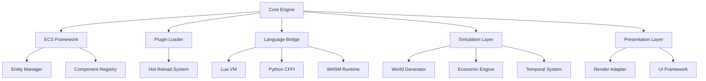
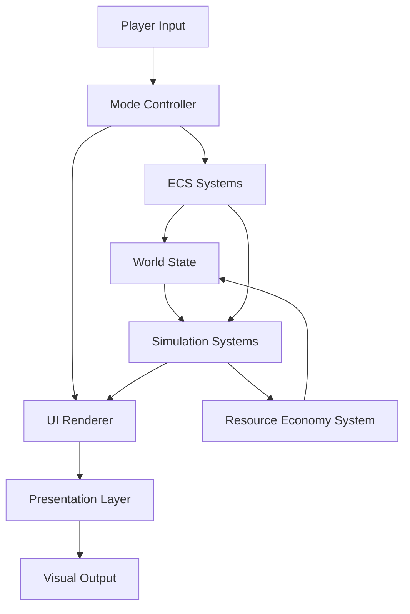
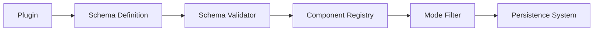
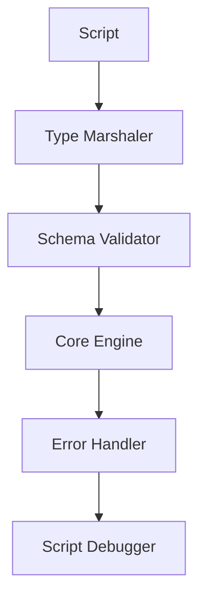
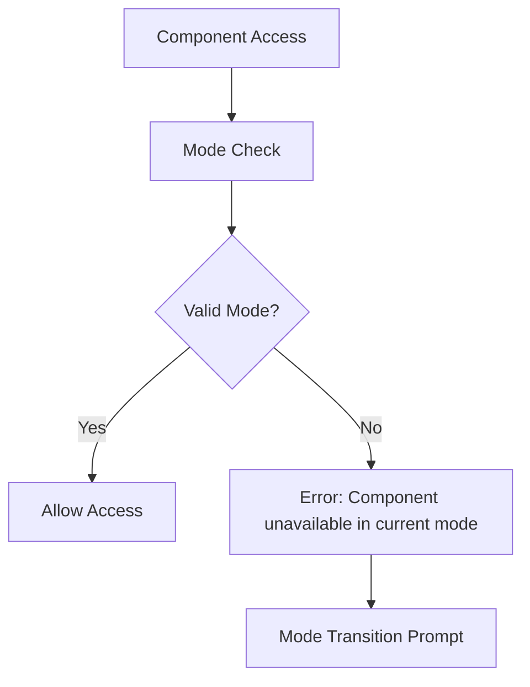
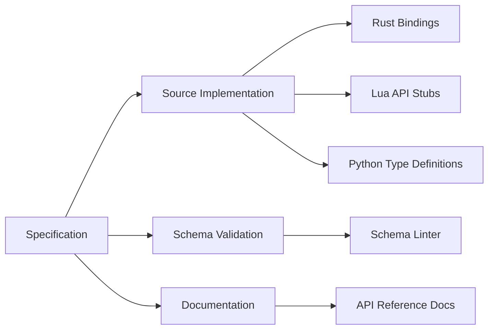
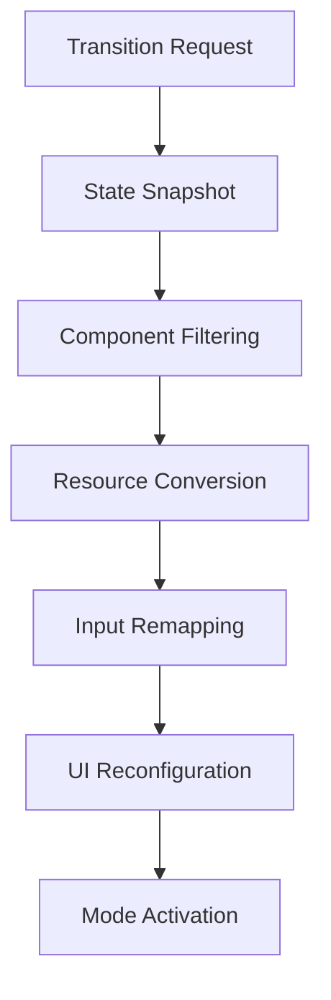

# Modular Game Engine Blueprint

## Core Architecture



---

## Data Flow Architecture



---

## Language & Technology Matrix

| Module            | Recommended Language | Rationale                    |
| ----------------- | -------------------- | ---------------------------- |
| Core Engine       | Rust                 | Memory safety, performance   |
| ECS Framework     | Rust                 | Zero-cost abstractions       |
| Plugin System     | C ABI                | Cross-language compatibility |
| Colony Mode Logic | Lua                  | Modding flexibility          |
| Roguelike Systems | Lua/Python           | Rapid iteration              |
| Web Integration   | WASM                 | Browser compatibility        |
| Build System      | Zig                  | Cross-compilation advantages |

---

## Component Schema Management

### 1. Mode-Specific Component Definition

```json
{
  "component_schemas": {
    "Colony::Happiness": {
      "fields": {
        "base_value": "float32",
        "modifiers": "Modifier[]"
      },
      "persistence": {
        "modes": ["colony"],
        "storage": "global"
      }
    },
    "Roguelike::Inventory": {
      "fields": {
        "slots": "ItemSlot",
        "weight": "float32"
      },
      "persistence": {
        "modes": ["roguelike"],
        "storage": "entity-bound"
      }
    }
  }
}
```

### 2. Registration Mechanism



---

## Cross-Language Type System

### 1. Type Mapping Rules

| Engine Type | Lua      | Python    | Go        | WASM        |
| ----------- | -------- | --------- | --------- | ----------- |
| Entity      | userdata | class     | struct    | object      |
| Component   | table    | dataclass | interface | JSON        |
| Resource    | number   | float     | float32   | f32         |
| Callback    | function | callable  | interface | WebAssembly |

### 2. Type Safety Layer



---

## Mode-Specific Field Management

### 1. Field Definition Protocol

```yaml
field_rules:
  - component: Colony::Happiness
    fields:
      - name: base_value
        type: float32
        constraints:
          min: 0.0
          max: 1.0
        mode_binding: colony
  - component: Roguelike::Inventory
    fields:
      - name: weight
        type: float32
        constraints:
          min: 0.0
        mode_binding: roguelike
```

### 2. Enforcement Mechanism



---

## Implementation Strategy

### 1. Language-Specific Responsibilities

- **Rust**:
  - Memory management
  - ECS core
  - Thread scheduling
- **Lua**:
  - Game logic
  - Mode-specific behavior
  - Modding API surface
- **Python**:
  - Data analysis
  - Content pipeline
- **WASM**:
  - Web exports
  - Browser-based tools
  - Secure sandboxing

### 2. Artifact Generation Workflow



---

## Development Workflow

### 1. Component Creation Process

1. Define schema in YAML/JSON
2. Generate type definitions
3. Register with component registry
4. Implement systems using type-safe interfaces
5. Bind to specific modes via manifest

### 2. Mode Transition Sequence



---

## Milestones

1. **Core System Contracts**

   - Finalize ECS interface specification
   - Define plugin ABI standards
   - Establish serialization protocol

2. **Implementation Steps**

   - Generate Rust trait definitions
   - Create Lua type stubs
   - Produce API documentation templates

3. **Prototype Priorities**
   - Mode switching foundation
   - Cross-language type marshaling
