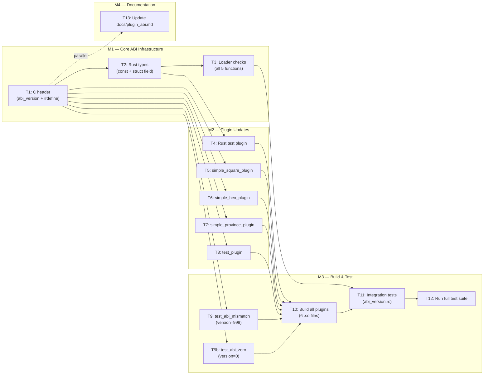

# PLAN: Plugin ABI Versioning

## Overview

Add ABI version checking to the MGE plugin system. An `abi_version` field (at offset 0) is added to `PluginVTable` in both the C header and the Rust mirror. Five plugin load functions validate this field before calling any plugin code. All 5 plugins (4 C, 1 Rust) are updated to export the version. A mismatch test plugin is created, and integration tests verify all acceptance criteria.

**Scope**: 9 files modified, 1 file created, ~6 tasks for Artisans.
**Spec**: `knowledge/spec-plugin-abi-version-2026-05-27.md`

---

## Milestones

| Milestone | Description | Tasks | Depends On |
|-----------|-------------|-------|------------|
| M1 — Core ABI Infrastructure | C header + Rust types + loader checks | T1, T2, T3 | None |
| M2 — Plugin Updates | All 5 plugins set abi_version | T4, T5, T6, T7, T8 | M1 |
| M3 — Build & Test | Bad version plugin, build, integration tests | T9, T10, T11, T12 | M1, M2 |
| M4 — Documentation | Update plugin_abi.md | T13 | M1 (can overlap M3) |

---

## Task Breakdown

### Milestone M1 — Core ABI Infrastructure

---

#### T1: Add `PLUGIN_ABI_VERSION` constant and `abi_version` field to C header

- **Agent**: Artisan
- **Depends on**: None
- **Description**:
  1. Add `#define PLUGIN_ABI_VERSION 1` after the `#include` guard (`#define ENGINE_PLUGIN_ABI_H`) on line 2, before the `#ifdef __cplusplus` block
  2. Insert `unsigned int abi_version;` as the **first field** of `PluginVTable` (before `init`), with doc comment `// MUST equal PLUGIN_ABI_VERSION`
  3. The field must be at offset 0 — before all function pointers
- **Files touched**:
  - `engine/engine_plugin_abi.h` (lines 1-3 for constant, line 25 for field)
- **Verification criteria**:
  - [ ] `#define PLUGIN_ABI_VERSION 1` present in header
  - [ ] `unsigned int abi_version;` is first field of `PluginVTable`
  - [ ] Field has doc comment `// MUST equal PLUGIN_ABI_VERSION`
  - [ ] Header parses with `gcc -fsyntax-only -I engine`
  - [ ] AC009: Exactly one `#define PLUGIN_ABI_VERSION` in all `.h` files
  - [ ] AC010: Value is `1`

---

#### T2: Add `PLUGIN_ABI_VERSION` constant and `abi_version` field to Rust types

- **Agent**: Artisan
- **Depends on**: T1 (struct layout is determined by header — Rust must match)
- **Description**:
  1. Add `pub const PLUGIN_ABI_VERSION: u32 = 1;` at module level in `types.rs` (before the `PluginVTable` struct)
  2. Insert `pub abi_version: u32` as the **first field** of the Rust `PluginVTable` (before `init`), with doc comment `/// MUST equal PLUGIN_ABI_VERSION`
- **Files touched**:
  - `engine/core/src/plugins/types.rs` (add constant before line 52, add field before line 54)
- **Verification criteria**:
  - [ ] `pub const PLUGIN_ABI_VERSION: u32 = 1;` present in `types.rs`
  - [ ] `pub abi_version: u32` is first field of Rust `PluginVTable`
  - [ ] Field has doc comment `/// MUST equal PLUGIN_ABI_VERSION`
  - [ ] `cargo check -p engine_core` succeeds
  - [ ] AC009: Exactly one `pub const PLUGIN_ABI_VERSION` in all `.rs` files
  - [ ] AC010: Value is `1`

---

#### T3: Add version check to all 5 plugin loader functions

- **Agent**: Artisan
- **Depends on**: T2 (needs `PLUGIN_ABI_VERSION` const and `abi_version` field on Rust struct)
- **Description**:
  In `engine/core/src/plugins/loader.rs`, after the null-pointer check on `plugin_vtable` and before the `init` call in each of the 5 functions, insert:

  ```rust
  let plugin_version = vtable_ref.abi_version;
  if plugin_version != PLUGIN_ABI_VERSION {
      return Err(format!(
          "Plugin '{}' ABI version mismatch: expected {}, got {}",
          path.as_ref().display(),
          PLUGIN_ABI_VERSION,
          plugin_version,
      ));
  }
  ```

  **Applicable functions** (exact injection points — after null check, before `init` call):

  | Function | After null check (line ~) | Before init (line ~) |
  |---|---|---|
  | `load_plugin` | after line 35 | before line 38 |
  | `load_plugin_and_register_worldgen_threadsafe` | after line 63 | before line 66 |
  | `load_plugin_and_register_worldgen` | after line 132 | before line 135 |
  | `load_plugin_and_register_systems` | after line 201 | before line 204 |
  | `load_plugin_with_manifest` | after line 286 | before line 289 |

  The `lib` variable must be retained in scope (some functions return it wrapped in a closure; the check must not cause a premature drop). In functions using `lib` inside a closure (`load_plugin_and_register_worldgen*`), ensure the library remains alive by not moving the check after the borrow. The check occurs before `init` but after obtaining `vtable_ref` — `vtable_ref` borrows from `lib` via `Symbol`, so `lib` is still alive.

- **Files touched**:
  - `engine/core/src/plugins/loader.rs` (5 insertion points)
- **Verification criteria**:
  - [ ] All 5 functions have the version check between null check and `init` call
  - [ ] Error message format matches spec §3.5 exactly
  - [ ] `cargo check -p engine_core` succeeds
  - [ ] No `unwrap()`, `panic!()`, or `abort!()` in the check path
  - [ ] AC003: Version check precedes `init` in all 5 functions
  - [ ] AC004: Error is `Err(String)`, not a panic
  - [ ] AC007: Error message contains path, expected (1), and actual version
  - [ ] AC008: All 5 functions perform the check

---

### Milestone M2 — Plugin Updates

All tasks in M2 depend on T1 (C header has the new struct layout). They can be parallelized.

---

#### T4: Update Rust test plugin — add `abi_version` to local struct and VTABLE init

- **Agent**: Artisan
- **Depends on**: T1 (struct layout), T2 (`PLUGIN_ABI_VERSION` constant concept — but plugin defines its own locally since it can't import from engine_core)
- **Note**: The Rust plugin (`plugins/rust_test_plugin/src/lib.rs`) is a standalone cdylib with its own `PluginVTable` struct definition. It does NOT import from `engine_core`. Therefore it must either:
  - (a) Define its own `const PLUGIN_ABI_VERSION: u32 = 1;` locally, or
  - (b) Hardcode `1` in the field initializer
  - **Recommendation**: Define a local const for clarity and maintainability.
- **Description**:
  1. Add `pub const PLUGIN_ABI_VERSION: u32 = 1;` to the file (after `use` statements, before struct definitions)
  2. Add `abi_version: u32` as the **first field** of the local `PluginVTable` struct (before `init`, line 37)
  3. Add `abi_version: PLUGIN_ABI_VERSION,` as the first field in the `VTABLE` static initializer (line 115)
- **Files touched**:
  - `plugins/rust_test_plugin/src/lib.rs` (add const, add field to struct, add field to init)
- **Verification criteria**:
  - [ ] Local `PluginVTable` has `abi_version: u32` at offset 0
  - [ ] Static `VTABLE` initializer sets `abi_version: PLUGIN_ABI_VERSION`
  - [ ] `cargo build --release -p rust_test_plugin` succeeds (via `build-plugins`)

---

#### T5: Update simple_square_plugin — set abi_version

- **Agent**: Artisan
- **Depends on**: T1 (header needs `PLUGIN_ABI_VERSION` and new struct layout)
- **Description**:
  Add `vtable.abi_version = PLUGIN_ABI_VERSION;` as the first assignment in the `init_vtable()` constructor function (line 141)
- **Files touched**:
  - `plugins/simple_square_plugin/simple_square_plugin.c` (line 141)
- **Verification criteria**:
  - [ ] `vtable.abi_version = PLUGIN_ABI_VERSION;` is the first assignment in `init_vtable()`
  - [ ] AC006: Source-level verification confirms version is set

---

#### T6: Update simple_hex_plugin — set abi_version

- **Agent**: Artisan
- **Depends on**: T1
- **Description**:
  Add `vtable.abi_version = PLUGIN_ABI_VERSION;` as the first assignment in the `init_vtable()` constructor function (line 114)
- **Files touched**:
  - `plugins/simple_hex_plugin/simple_hex_plugin.c` (line 114)
- **Verification criteria**:
  - [ ] `vtable.abi_version = PLUGIN_ABI_VERSION;` is the first assignment in `init_vtable()`
  - [ ] AC006: Source-level verification confirms version is set

---

#### T7: Update simple_province_plugin — set abi_version

- **Agent**: Artisan
- **Depends on**: T1
- **Description**:
  Add `vtable.abi_version = PLUGIN_ABI_VERSION;` as the first assignment in the `init_vtable()` constructor function (line 55)
- **Files touched**:
  - `plugins/simple_province_plugin/simple_province_plugin.c` (line 55)
- **Verification criteria**:
  - [ ] `vtable.abi_version = PLUGIN_ABI_VERSION;` is the first assignment in `init_vtable()`
  - [ ] AC006: Source-level verification confirms version is set

---

#### T8: Update test_plugin — set abi_version

- **Agent**: Artisan
- **Depends on**: T1
- **Description**:
  Add `vtable.abi_version = PLUGIN_ABI_VERSION;` as the first assignment in the `init_vtable()` constructor function (line 33). Note: `test_plugin.c` declares `static struct PluginVTable vtable;` (line 11) — the `abi_version` field is accessed via the include header's struct definition.
- **Files touched**:
  - `plugins/test_plugin/test_plugin.c` (line 33)
- **Verification criteria**:
  - [ ] `vtable.abi_version = PLUGIN_ABI_VERSION;` is the first assignment in `init_vtable()`
  - [ ] AC006: Source-level verification confirms version is set

---

### Milestone M3 — Build & Test

Depends on all of M1 (loader has checks) and M2 (plugins export version).

---

#### T9: Create test plugin with wrong ABI version

- **Agent**: Artisan
- **Depends on**: T1 (needs the header with new struct layout)
- **Description**:
  Create a minimal C plugin under `plugins/test_abi_mismatch/` that compiles to `libtest_abi_mismatch.so` with `abi_version = 999` (instead of `PLUGIN_ABI_VERSION`). The plugin must export a valid `PLUGIN_VTABLE` symbol with all function pointers set to stubs, but with the version field intentionally wrong. This enables AC002/AC003/AC004/AC005/AC007/AC008 testing.

  The file `plugins/test_abi_mismatch/test_abi_mismatch.c` should:
  - Include `engine_plugin_abi.h`
  - Define stub functions for all vtable entries
  - Define a global `PluginVTable vtable;`
  - Set `vtable.abi_version = 999;` (NOT `PLUGIN_ABI_VERSION`)
  - Export `PLUGIN_VTABLE` symbol

  Because `xtask`'s `build_c_plugins()` scans all subdirectories under `plugins/` for single `.c` files, this new directory will be automatically picked up during `make build-c-plugins`.

  **Note**: This plugin must NOT be deployed with production builds — it is for testing only. Document this clearly in the file header.
- **Files touched**:
  - `plugins/test_abi_mismatch/test_abi_mismatch.c` (new file)
- **Verification criteria**:
  - [ ] File exists at `plugins/test_abi_mismatch/test_abi_mismatch.c`
  - [ ] Sets `vtable.abi_version = 999;`
  - [ ] Compiles with `gcc -shared -fPIC -I engine -ljansson`
  - [ ] Produces `plugins/test_abi_mismatch/libtest_abi_mismatch.so`

---

#### T10: Build all plugins

- **Agent**: Artisan
- **Depends on**: T4, T5, T6, T7, T8, T9 (all plugin sources updated + bad version test plugin created)
- **Description**:
  1. Run `cargo run -p xtask -- build-plugins` — builds and deploys the Rust plugin (`rust_test_plugin`)
  2. Run `cargo run -p xtask -- build-c-plugins` — builds all C plugins (including `test_abi_mismatch`)
  3. Verify all 6 `.so` files exist:
     - `plugins/simple_square_plugin/libsimple_square_plugin.so`
     - `plugins/simple_hex_plugin/libsimple_hex_plugin.so`
     - `plugins/simple_province_plugin/libsimple_province_plugin.so`
     - `plugins/test_plugin/libtest_plugin.so`
     - `plugins/rust_test_plugin/librust_test_plugin.so`
     - `plugins/test_abi_mismatch/libtest_abi_mismatch.so`
- **Files touched**: None (build artifacts)
- **Verification criteria**:
  - [ ] All 6 `.so` files exist and are non-empty
  - [ ] Both build commands exit with code 0
  - [ ] No compilation warnings for the updated C plugins

---

#### T11: Add integration tests for ABI version checking

- **Agent**: Artisan
- **Depends on**: T10 (compiled .so files must exist), T3 (loader checks are in place)
- **Description**:
  Create `engine/core/tests/abi_version.rs` with the following test cases. Follow the pattern from `plugins_loading.rs` and `helpers/worldgen.rs` for loading plugins.

  **Test cases** (cross-reference to acceptance criteria):

  | Test | AC | Description |
  |------|----|-------------|
  | `test_matching_version_loads` | AC001 | Load each of the 5 real plugins via their matching load function — expect `Ok(())` |
  | `test_mismatched_version_rejected` | AC002, AC007 | Load `test_abi_mismatch` (version=999) via `load_plugin` — expect `Err(...)` with message matching `"Plugin '.*' ABI version mismatch: expected 1, got 999"` |
  | `test_version_check_before_init_all_functions` | AC003, AC008 | Call all 5 load functions with the bad version plugin — verify each returns `Err` before `init` could have been called (if possible, use a side-effect flag in the bad plugin's init that we can assert was NOT triggered) |
  | `test_error_is_returned_not_panicked` | AC004 | The bad version load returns `Err` — assert it's `Err`, not a panic (this is structural, verified by the test not panicking) |
  | `test_pre_versioning_plugin_rejected` | AC005 | Create a scenario where `abi_version` is 0 or uninitialized — use a zeroed-out vtable scenario or compile a small C snippet with `abi_version = 0` to verify rejection |
  | `test_error_message_format` | AC007 | Assert that the error string contains: the plugin path, `"expected 1"`, `"got 999"` |

  **For AC003**: To prove `init` was never called, the bad version plugin's init stub can set a global flag. The test loads the plugin once (expecting failure), then checks the flag is still 0. However, since the bad plugin uses a constructor-based vtable setup, the `init` function won't be reached if the version check fails. An alternative: verify via code review + the fact that the version check is placed before `init` in the source.

  **For AC005 (pre-versioning detection)**: The simplest approach — compile a second minimal test plugin that sets `abi_version = 0` (doesn't match 1, so rejected). This covers the same detection path as a truly pre-versioning plugin. Create `plugins/test_abi_zero/test_abi_zero.c` as part of T9b (or fold into T9 as a second file — but xtask requires one `.c` per dir). **Alternative**: Use `abi_version = 0` in the existing `test_abi_mismatch` if feasible, but 999 is clearer for the primary test. Recommend: create `plugins/test_abi_zero/test_abi_zero.c` as a sibling to `test_abi_mismatch`. Add this as a sub-task of T9.

  **Reference**: Helper setup code can reuse `EngineApi` from `engine_core::plugins::EngineApi` and `ffi_spawn_entity`/`ffi_set_component` from `engine_core::plugins`.
- **Files touched**:
  - `engine/core/tests/abi_version.rs` (new file)
  - Possibly `plugins/test_abi_zero/test_abi_zero.c` (new file, if added for AC005)
- **Verification criteria**:
  - [ ] All test cases pass with `cargo test -p engine_core --test abi_version`
  - [ ] AC001: Matching version test passes for all 5 real plugins
  - [ ] AC002: Mismatch test catches version 999
  - [ ] AC003: Version check is structurally before init (verify via source + test assertion)
  - [ ] AC004: No panic on version mismatch
  - [ ] AC005: `abi_version = 0` is rejected
  - [ ] AC007: Error message contains path, expected, actual
  - [ ] AC008: All 5 load functions return version mismatch error

---

#### T12: Run full test suite to verify no regressions

- **Agent**: Artisan
- **Depends on**: T11 (test code exists), T10 (plugins built)
- **Description**:
  1. Set `LD_LIBRARY_PATH` to include `$PWD/plugins` (required by tests)
  2. Run `cargo test --all` (or `make test-rust`) to run all Rust tests
  3. Verify all tests pass including the new ABI version tests
  4. If any tests fail, diagnose and fix before marking complete
- **Files touched**: None
- **Verification criteria**:
  - [ ] `cargo test --all` exits with code 0
  - [ ] All 108+ integration tests pass (including new ABI tests)
  - [ ] Zero regressions in existing plugin loading tests

---

### Milestone M4 — Documentation

Can be done in parallel with M3 after T1 is complete.

---

#### T13: Update `docs/plugin_abi.md` with versioning documentation

- **Agent**: Artisan
- **Depends on**: T1 (knows the final struct layout)
- **Parallel with**: M3 (no code dependency)
- **Description**:
  1. Add `abi_version` field to the VTable Structure table in `docs/plugin_abi.md` (line 57-69)
  2. Document the `PLUGIN_ABI_VERSION` constant and its purpose
  3. Document the versioning scheme: single integer, increments on breaking ABI changes, checked at load time
  4. Document the load-time validation behavior (what happens on mismatch)
  5. Update any field descriptions to include `abi_version`
- **Files touched**:
  - `docs/plugin_abi.md` (update VTable struct table, add versioning section)
- **Verification criteria**:
  - [ ] `abi_version` field is documented as the first field of `PluginVTable`
  - [ ] `PLUGIN_ABI_VERSION` constant is documented with its value (1)
  - [ ] Versioning scheme is described (single integer, bump on breaking changes)
  - [ ] Load-time mismatch behavior is documented
  - [ ] Document renders correctly in Markdown

---

## Dependency Graph



**Sequential dependencies (critical path)**:
```
T1 → T2 → T3 → T9a → T9b → T10 → T11 → T12
                                     ↗
                            T4-T8 ───┘
```

**Parallel groups**:
- T5/T6/T7/T8 (4 C plugins) — fully parallel after T1
- T4 (Rust plugin) — after T2
- T13 (docs) — parallel with all of M3 after T1
- T9a/T9b (test plugins) — after T1, can be parallel with T5-T8

---

## Risks and Mitigations

| Risk | Impact | Likelihood | Mitigation |
|------|--------|------------|------------|
| **Rust plugin's `PLUGIN_ABI_VERSION` source** — The Rust plugin (`rust_test_plugin`) cannot import from `engine_core` (it's a standalone cdylib). It needs its own copy of the constant. If the constant drifts from the engine's value, tests silently pass but the plugin would fail at load time. | Medium | Low | Define the constant locally with a comment referencing the canonical source. Add a test assertion in `abi_version.rs` that the plugin's stored version equals the engine's `PLUGIN_ABI_VERSION`. |
| **Build order in CI** — Tests require `.so` files to exist before running. The `build-c-plugins` step must run before tests. | High | Low | Documented required order in the spec. The `make test` recipe already includes this. Add `abi_version.rs` to the test manifest. |
| **Rust plugin static VTABLE can't use field initializer** — The current Rust plugin uses a `static mut VTABLE: PluginVTable = PluginVTable { ... };` which requires all fields to be initialized at compile time. Adding a new field works fine with named field syntax. | Low | Very Low | Named struct initialization (`Field: value,`) handles this. |
| **xtask's `build_c_plugins` only supports 1 `.c` file per dir** — If T9 creates a new plugin dir with a single `.c` file, this is fine. But if we need to add multiple test plugins, each needs its own directory. | Low | Low | Each test plugin gets its own directory (e.g., `test_abi_mismatch/`, `test_abi_zero/`). |
| **`vtable_ref` borrow from `lib` via `Symbol`** — In the loader functions, `vtable_ref` borrows from `lib` through the `vtable` `Symbol`. The version check must happen while `lib` is still alive. In functions where `lib` is moved into a closure (e.g., `load_plugin_and_register_worldgen_threadsafe`), the check must occur before the move. | Medium | Medium | The check is placed before `init`, which already occurs before `lib` is moved into any closure. This is safe as long as the check is inserted before the `init` call (per the spec). |

---

## Spec Coverage Cross-Reference

| Requirement | Task(s) | Verifiable By |
|-------------|---------|---------------|
| R001 — ABI version constant | T1, T2 | Source inspection, grep |
| R002 — Version field in PluginVTable | T1, T2 | Source inspection |
| R003 — Load-time version validation | T3 | Source inspection, T11 |
| R004 — Graceful error on mismatch | T3, T11 | T11 asserts `Err(String)` |
| R005 — All 5 plugins export version | T4, T5, T6, T7, T8 | Source inspection + T10 |
| R006 — Version check before init | T3 | Source inspection + T11 |
| R007 — Outdated plugin detection | T9b, T11 | T11 test for abi_version=0 |
| R008 — Documentation update | T13 | Document review |
| NFR001 — Zero overhead | T3 | Code review (single `u32` comparison) |
| NFR002 — Single integer scheme | T1, T13 | Source inspection |
| NFR003 — Consistent error format | T3 | T11 asserts format string |
| NFR004 — Compile-time constant | T1, T2 | Source inspection (`#define`/`const`) |
| AC001 — Matching version loads | T11 (test) | Test passes |
| AC002 — Mismatched version rejected | T9a, T11 | Test passes |
| AC003 — Version check precedes init | T3, T11 | Source + test |
| AC004 — Error returned, not panicked | T3, T11 | Test asserts `Err` |
| AC005 — Pre-versioning rejected | T9b, T11 | Test passes |
| AC006 — All 5 plugins set version | T4-T8 | Source inspection |
| AC007 — Error message format | T3, T11 | Test asserts format |
| AC008 — All 5 functions check | T3, T11 | Test calls each function |
| AC009 — Constant defined once each | T1, T2 | `grep -rn PLUGIN_ABI_VERSION` |
| AC010 — Version 1 remains 1 | T1, T2, T11 | Source + test assertion |

---

## Knowledge Checkpoint

This PLAN KD is the checkpoint. Commit it before any implementation begins.
